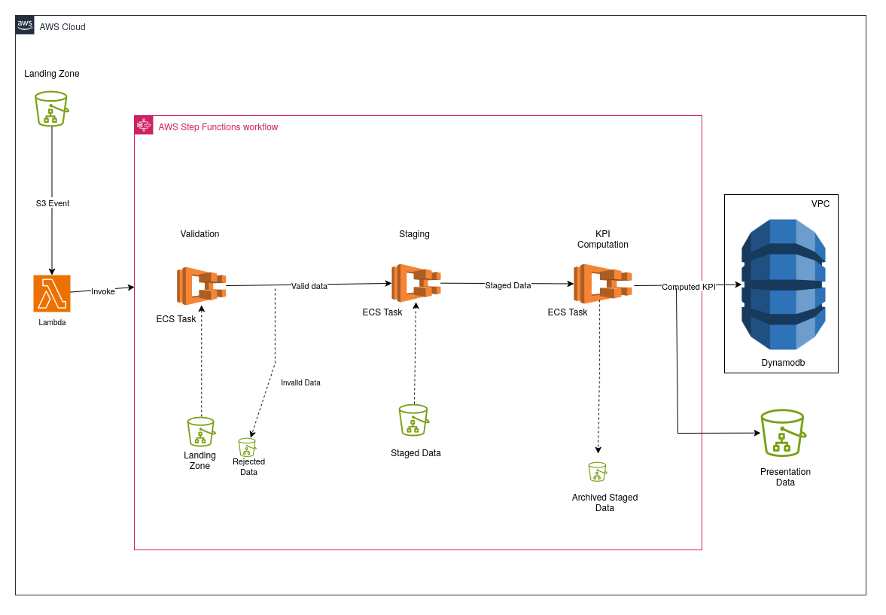
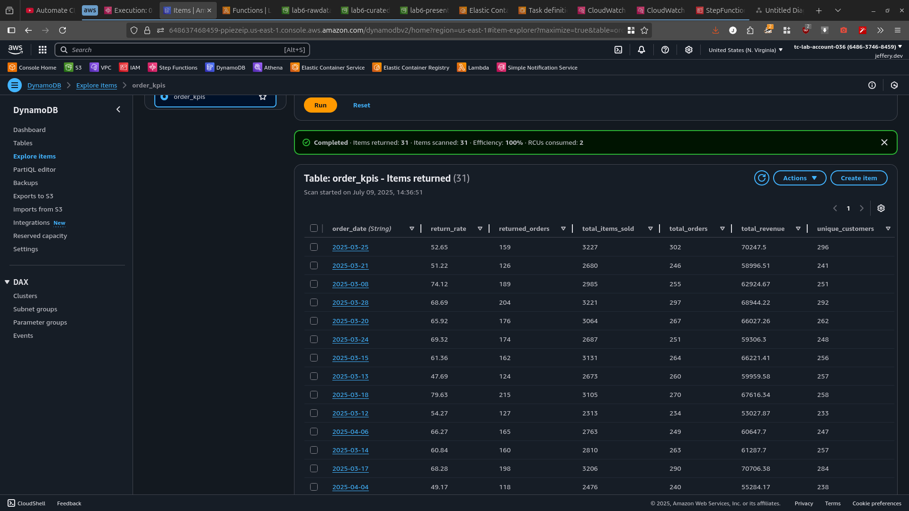
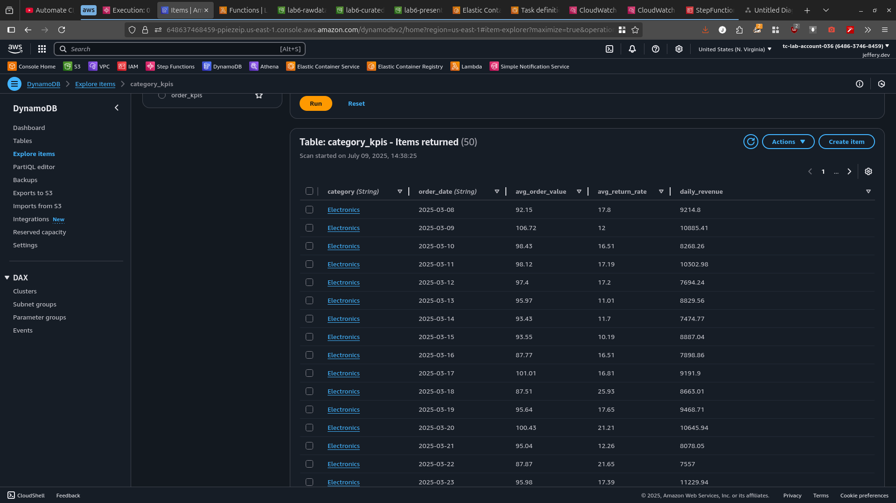
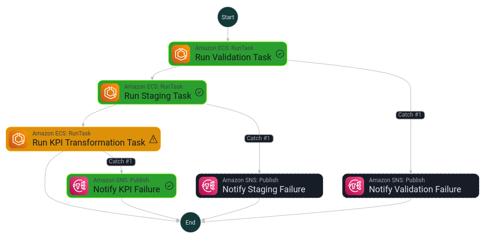
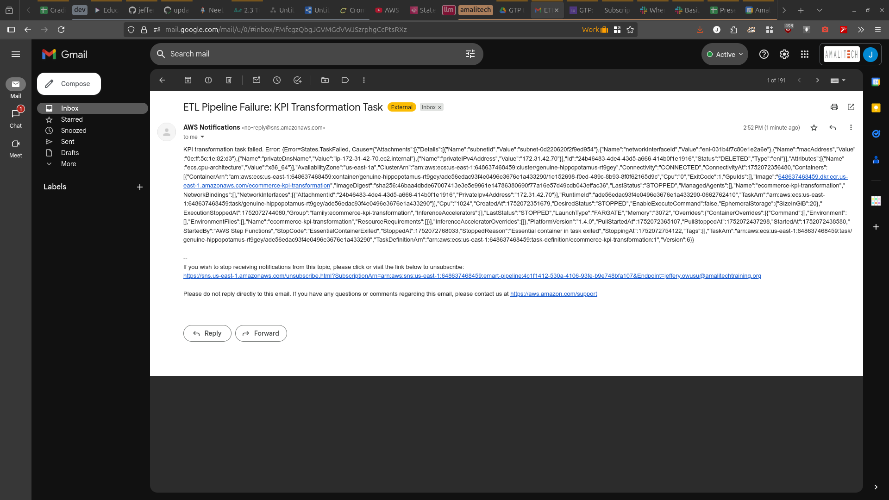
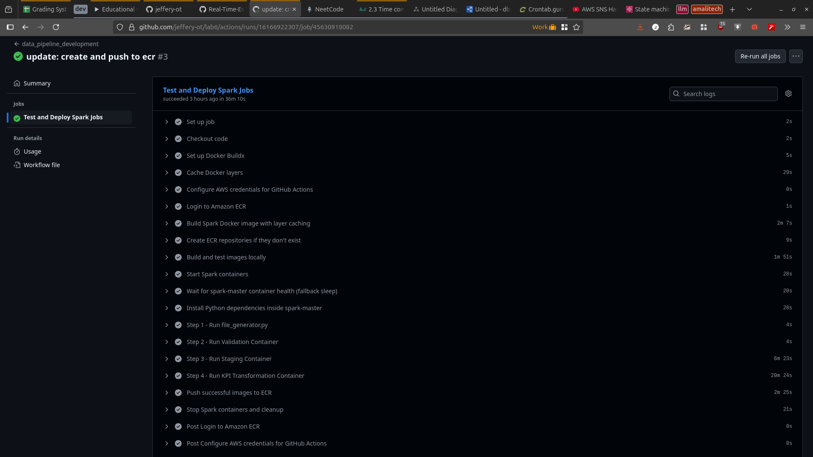

## Real-Time Event-Driven Data Pipeline for an E-Commerce shop

+ Designing and building a real-time, event-driven data pipeline to support
operational analytics for an e-commerce platform

### Data Architecture

---

## Data Pipeline Documentation

### Overview

This pipeline processes raw CSV files uploaded to S3 by validating, staging, and computing KPIs using Apache Spark and Delta Lake. It is orchestrated via AWS Step Functions and monitored through SNS notifications.

---

### 1. File Ingestion

* **Input Location:** `s3://lab6-rawdata/landing-zone/`
* **Trigger:** AWS Lambda (invoked on new S3 object)
* **Workflow:** Lambda → Step Function → Validation → Staging → KPI Computation

---

### 2. Data Validation (`validation.py`)

* **Purpose:** Ensure CSV data has correct structure and types.
* **Validations:**

  * Required columns exist
  * Correct data types (e.g., `datetime`, `numeric`)
  * Missing values detection
* **Outputs:**

  * Valid files → `validated/`
  * Invalid schema → `rejected/`
  * Invalid rows → `quarantined/`
* **Logging:** Logs stored in `validation-logs/`

---

### 3. Delta Staging (`staging.py`)

* **Input:** Files from `validated/`
* **Output:** Delta tables in:

  * `s3://lab6-curated/staged-orders`
  * `s3://lab6-curated/staged-order-items`
  * `s3://lab6-curated/staged-products`
* **Operation:**

  * Upserts using `MERGE INTO`
  * Adds ingestion timestamp and optional partitioning
  * Archives processed files to `staged/`
* **Logging:** Logs stored in `staging-logs/`

---

### 4. KPI Computation

* **Data Source:** Staged Delta tables
* **KPI Types:**

  * Order KPIs (e.g., order count, total sales)
  * Category KPIs (e.g., product count, revenue by category)
* **Storage:**

  * Delta format in `order_kpis_delta/`, `category_kpis_delta/`
  * DynamoDB tables `order_kpis` and `category_kpis`

#### Tables
##### Order-level

##### Category-level

---

### 5. Orchestration and Monitoring

##### SNS Notif

* **Orchestration:** AWS Step Function

  * Steps: Validation → Staging → KPI Computation
* **Failure Alerts:** SNS notification with email subscription
* **Resilience:** Pipeline fails gracefully on individual step failures

---

## DynamoDB Table Schemas

### `order_kpis` Table

| Attribute    | Type   | Key Type      |
| ------------ | ------ | ------------- |
| `order_date` | String | Partition key |

**Notes:**

* Billing mode: `PAY_PER_REQUEST`
* All other attributes (e.g., `total_orders`, `total_revenue`, `return_rate`, etc.) are stored as flexible, non-key attributes.

---

### `category_kpis` Table

| Attribute    | Type   | Key Type      |
| ------------ | ------ | ------------- |
| `category`   | String | Partition key |
| `order_date` | String | Sort key      |

**Notes:**

* Billing mode: `PAY_PER_REQUEST`
* Additional attributes (e.g., `daily_revenue`, `avg_order_value`, `avg_return_rate`, etc.) are stored dynamically per item.

---

## Key Features

* **Chunk-wise Validation:** Handles large files efficiently
* **Schema-Aware Processing:** Dynamic detection of file types based on headers
* **Delta Lake Upserts:** Efficient merge and update of data
* **Quarantine Handling:** Segregates and stores bad records separately
* **Serverless Orchestration:** Event-driven with AWS Lambda and Step Functions
* **Auditability:** Centralized logging and archiving

---

## Best Practices

* **Column Sanitization:** Strip headers before processing to avoid mismatches
* **Fail Early:** Validate files before processing to reduce staging issues
* **Modular Design:** Separate scripts for validation, staging, and KPI computation
* **Use of Delta Lake:** Enables ACID transactions and efficient merges
* **Monitor Failures:** Use SNS for timely alerting and remediation
* **Versioned Logs:** Timestamped log storage for traceability
* **Scalability:** Designed to handle high volume via chunking and Spark

---

### CI/CD - GITACTION
